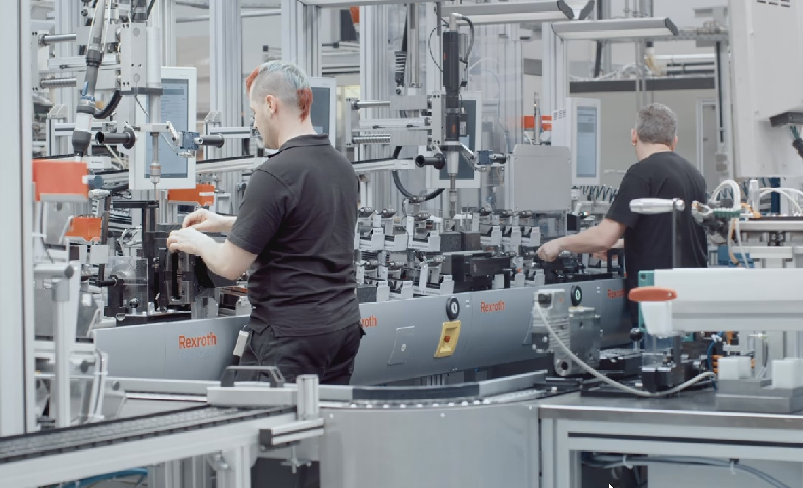

# Big Data Project

**Group Members:** Qianying Diao, Jiaru Xu, Xinrong Chen, Shirley Zhang

## Bosch Production Line Performance
### Summary

For our project, we focus on performance prediction for Bosch production line. In this case, the dataset is extremely imbalanced and with thousands of features. At the data preparation stage, we oversampled the data by SMOTE and did feature engineering. Then we utilized Spark SQL and XGBoost to analyze data. We tried four different binary classification models: random forest model, logistic regression model, gradient boosted tree classifier and XGBoost. Finally, we use Matthews correlation coefficient (MCC) to evaluate the model. 

### Introduction

Bosch, one of the world's leading manufacturing companies, has an imperative to ensure that the recipes for the production of its advanced mechanical components are of the highest quality and safety standards. Part of doing so is closely monitoring its parts as they progress through the manufacturing processes. Because Bosch records data at every step along its assembly lines, they have the ability to apply advanced analytics to improve these manufacturing processes. In this project, we are challenged to predict internal failures using thousands of measurements and tests made for each component along the assembly line. This would enable Bosch to bring quality products at lower costs to the end user.

### Data Description

The data represents measurements of parts as they move through Bosch's production lines. Each part has a unique Id. The goal is to predict which parts will fail quality control (represented by a 'Response' = 1). The dataset contains an extremely large number of anonymized features and the files are separated by the type of feature they contain: numerical, categorical, and date features. Features are named according to a convention that tells you the production line, the station on the line, and a feature number. 

### Files

**train_numeric.csv** - the training set numeric features (this file contains the 'Response' variable)

**train_categorical.csv** - the training set categorical features

**train_date.csv** - the training set date features

### Code Files
**Bosch-CXR.ipynb**

**Project_7.16_DQY.ipynb**

**Step_1_Exploratory_Data_Analysis.ipynb**

**Step_2_Feature_Engineering.ipynb**

**Step_3_Modeling.ipynb**

## Methods
* How you cleaned, prepared the dataset with samples of intermediate data?

We prepared the dataset by oversampling method SMOTE. Meanwhile, as for numeric features, we did feature engineering by generating features for each station according to maximum and minimum values. As for categorical features, we pick columns with largest variance. As for date features, we dropped duplicate columns.

* Tools you used for analyzing the dataset and the justification (tools, models, etc.)

We use Spark SQL and XGBoost to analyze the dataset. Since we are dealing with more than 1,000,000 rows and 1,000 to 2,000 columns per file, Spark SQL runs faster with such huge amount of data. Because there are thousands of features, we use XGBoost to select features according to their feature importance.

* How did you model the dataset, what techniques did you use and why?

We run random forest model, logistic regression model and gradient boosted tree classifier on Spark and run XGBoost locally. We choose these models because thay can do binary classification which is exactly what we need. 

* Did you have a hypothesis that you were trying to prove? 

No.

* Did you just visualize the dataset, and if so, why?

We looked at the schema to see the feature names and feature types. We calculated the error rate at different stations to get some insights. Since all the features are anonymized, there is no need for us to do other visualization.

## Results:
* What did you find and learn?

First, the data is extremely imbalanced and we find this imbalance problem will influence the accuracy of model prediction. Since standard classification algorithms usually consider a balanced training set and this supposes a bias towards the majority class. In this project, we realized that imbalance is a problem we should deal with before we start modeling. 
Second, because of the large amount of features, we learned how to do feature engineering.
Third, at the start of modeling part, we naturally believe random forest will be the best model since it suits for a lot of dataset. However, surprisingly, it turned out that random forest predicted bad with our dataset. We learn from the experience that there is no best model for one dataset but only suitable model.

* How did you validate your results?
We use Matthews correlation coefficient (MCC) to evaluate the model performance because the prediction classification is imbalanced.
## Future work: 
* what would you do differently and what follow-up work would you do?
What we would do differently is that we would open a cluster with larger instances before manipulating the dataset and modeling since we spent most of our time on waiting the results of model training. 
We would use alternative methods to deal with imbalanced, sparse data and we would do model tuning.
